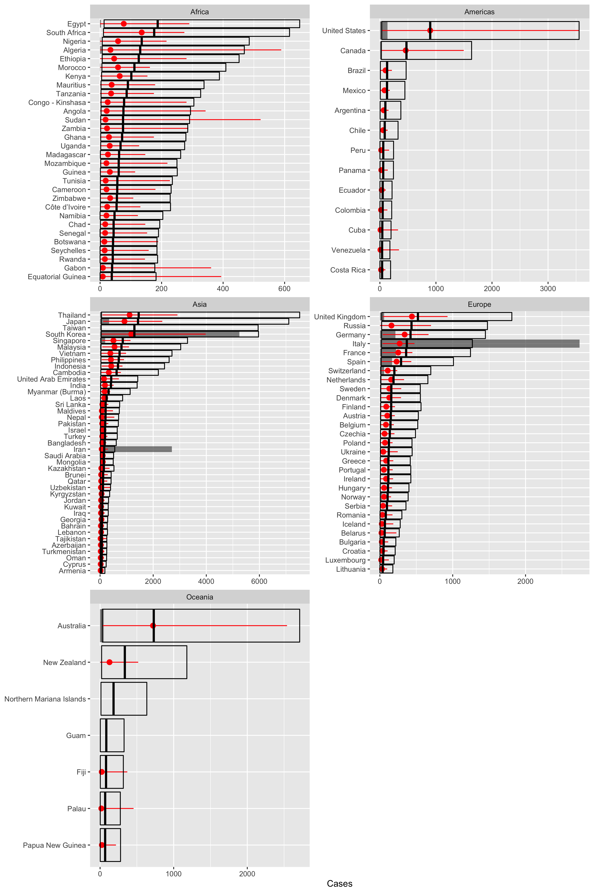
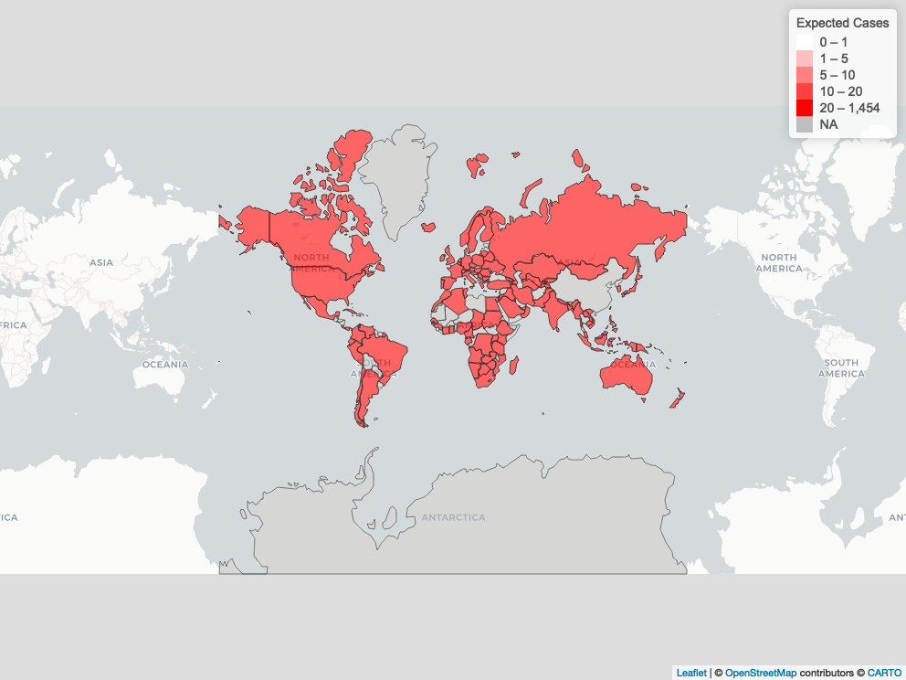

# Importation Risk of COVID-19 to African countries
*Latest data update: 02.03.2020*

## Background

Multiple international cases of the novel coronavirus disease (COVID-19) have been observed outside of China since the start of the epidemic. Whilst the majority of these are exported cases with a direct link to the epidemic in China, some countries are seeing cases of sustained onwards transmissions as well. Outbreaks in other countries of the magnitude observed in China would pose a significant strain on public health resources, in particular in resource poor settings across Africa. To limit this, early detection of imported cases is crucial.

## Model

Here a statistical model previously developed by [De Salazar et al](https://doi.org/10.1101/2020.02.04.20020495) to countries that have observed exported cases is altered and extended to the rest of the world including African countries. Model estimates are based on a Poisson generalised linear regression model using the internationally observed cases so far to provide an estimate for the expected number of cases that may or may not have been observed in any given location.

Internationally exported cases were taken from [publicly available line list data collected by Johns Hopkins University](https://github.com/CSSEGISandData/COVID-19).

Two measures are used as explanatory variables:
* [**Connectivity of countries to China**](https://www.mobs-lab.org/2019ncov.html) - Defined by a relative risk of importation measure developed by the MOBS lab that uses global air travel data (International Air Transport Association and Official Airline Guide databases) and short-scale mobility between adjacent subpopulations
* [**The Global Health Security (GHS) index**](https://www.ghsindex.org/) - A measure of surveillance capacity in terms of early detection and reporting.

Note that [De Salazar et al](https://doi.org/10.1101/2020.02.04.20020495) utilised the GHS index by limiting their regression to countries in the top 75th percentile. In this analysis it is used as a seperate explanatory variable. This allows predictions to include the expected number of cases as well as the expected number of observed cases for each country given their GHS index.

## Results

Predictions were made using the same bootstrapping methodology as in [De Salazar et al](https://doi.org/10.1101/2020.02.04.20020495). Two 95% Prediction interval estimates were created for each country:
1. Expected number of cases to be observed given a country's GHS index (red point range interval)
2. Expected number of cases to be observed assuming the global top GHS index (equivalent to the US) for each country (boxplot interval)

The grey bars show the exported cases that have been observed.

Click [here](https://rpubs.com/mwagner/581278) for an interactive map that shows the model estimates and the exported cases observed so far.

## Other related work

* The [WorldPop group](https://www.worldpop.org/events/china) did an initial analysis of risk of importation based on travel volume, tables 6 and 7 focus on African countries and align with our estimates.
* The [EPIcx Lab](https://www.epicx-lab.com/news/preparedness-and-vulnerability-of-african-countries-against-introductions-of-2019-ncov) look at introduction risk to Africa based on air travel data including measures of capacity/preparedness (SPAR capacity index and Infectious Disease Vulnerability Index). Their relative risk estimates by country align with our estimates.
* The [MOBS lab](https://www.mobs-lab.org/2019ncov.html)
* [De Salazar et al](https://doi.org/10.1101/2020.02.04.20020495) study
